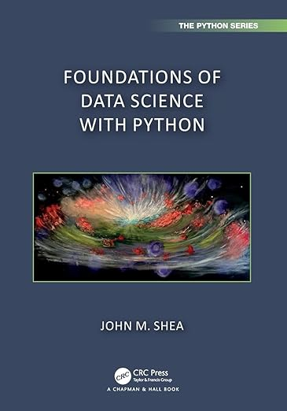

# Foundations of Data Science with Python
## by John M. Shea

This repository is the source for the website to accompany this book:

The scheduled publication date is February 22, 2024. You can <a href="https://amzn.to/48PvKip" target="_blank">preorder from Amazon</a>. [Affiliate link]

### About the book
This book is an introduction to the foundations of data science, including data visualization, statistics, probability, and linear algebra. This book is targeted toward engineers and scientists, but it should be easily accessible to anyone who knows basic calculus and the basics of computer programming. By leveraging this background knowledge, this book fits a unique niche in the books on data science and statistics:

* This book applies a modern, computational approach to work with data, and in particular, uses simulations (an approach called resampling) to answer statistical questions.
* Many books on statistics (especially those for engineers) teach a theoretical approach to answering statistical questions that many learners find difficult to understand. Most learners can easily understand how resampling works in contrast to some arcane formula.
* This text provides a basic, but rigorous, introduction to probability and its application to statistics.
* Some of the other books that use the resampling approach to statistics omit the mathematical foundations because they are targeted toward a broader audience who may not have the rigorous mathematical background of engineers and scientists.
* This book provides a solid introduction to linear algebra and its application to data science by leveraging existing computational libraries.
* Techniques like data reduction and selection require linear algebra, and many books on statistics omit these topics because of the difficulty of covering linear algebra and statistics.
* Real data sets are used wherever practical.
* Many statistics books use contrived examples to make examples that are solvable using a calculator, but the majority of the data sets used in this book are analyzed using computer programs.
* The data sets and the questions asked are chosen to appeal to a broad audience.
* Although the approach taken and the material covered is targeted toward engineers and scientists, I try to investigate questions that will appeal to most readers, and especially those that may appeal to college students.
* The book has a unique set of interactive materials.
  These are available on the book's website, <a href="https://www.fdsp.net" target="_blank">fdsp.net</a>. This GitHub repository contains the source files for that site.
  
### About the website
The website contains material that could not be included in the book itself, including:

Interactive tools to help students learn the material, including:

Interactive self-assessment quizzes via <a href="jupyterquiz.org">JupyterQuiz</a>

Interactive flashcards to aid in learning terminology via <a href="jupytercards.org">JupyterCards </a>

Animations and interactive visualizations

Problem sets for homework or additional practice (Coming soon!)

Errata for the book (When available)

A list of websites and books for those who want to continue their learning: [Next Steps](https://www.fdsp.net/16-next-steps/next-steps.html)

**As an Amazon Associate I earn from qualifying purchases.**
